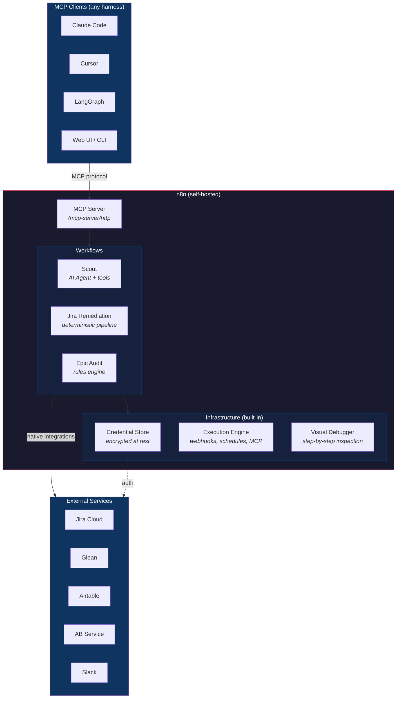
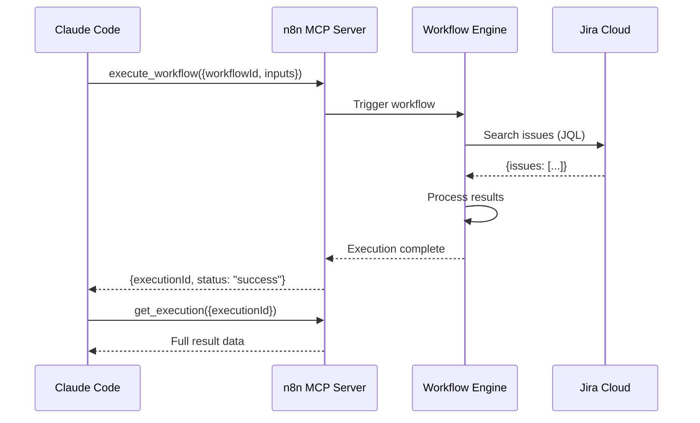

# Sidekick (n8n)

Workflow automation for AI agent capabilities, powered by n8n and exposed via MCP to any compatible client.

## The Problem

Building useful AI agent capabilities (like a "Scout" that investigates across Jira, Glean, Airtable, and AB testing services) requires assembling a lot of moving parts:

- **Multiple external services**, each with their own auth and APIs
- **Domain constraints** that keep the agent focused (e.g., Jira and Airtable, not code archaeology)
- **LLM orchestration** to reason over gathered information
- **Credential management** — OAuth flows, API tokens, secure storage
- **Output contracts** so callers get structured, predictable results

Today, wiring all of this up in Claude Code means configuring plugins, subagent prompts, hook files, MCP server entries, and local scripts — all tightly coupled to one person's machine and one specific harness. Distributing the same capability to another engineer is an enormous hassle. Porting it to a different harness (Cursor, a hosted SDLC system, etc.) means starting over.

## The Insight

Most of these capabilities don't need to live inside the main Claude Code context. Subagents like Scout and Researcher are detached by design — dispatch, wait, get a result. From the caller's perspective, they're asynchronous black boxes.

The original approach ([dougboutwell/sidekick](https://github.com/dougboutwell/sidekick)) was to build a custom MCP facade in TypeScript — an MCP server on the outside, MCP clients on the inside, with a module system, tool routing, credential management, and agent execution engine in between. That worked, but it was converging on rebuilding what workflow automation platforms already do: manage connections to external services, orchestrate multi-step processes, handle auth, and expose results.

**n8n already does all of this.** It's an MCP server and client. It handles OAuth and credential storage. It has AI agent nodes with tool filtering and structured output. It has a visual debugger. And it's open source and self-hosted.

Instead of maintaining a custom engine, we use n8n as the execution layer and focus on building workflows.

## Architecture



### What the caller sees

```
Claude Code → execute_workflow({workflowId: "...", inputs: {...}}) → structured result
```

### What n8n handles internally

```
Inbound MCP tool call (execute_workflow)
  → Workflow trigger fires
    → Nodes execute: Jira queries, Glean searches, AI reasoning
      → Structured output returned
        → Result delivered to caller via MCP
```

## Workflow Types

These map to the module types from the original Sidekick design:

**Agent workflows** — AI Agent node + service tool nodes. Scout, Researcher. The LLM reasons over tool results and produces structured output. n8n's AI Agent node handles the tool loop; the Structured Output Parser enforces the return contract.

**Pipeline workflows** — deterministic node chains, no LLM. Jira ticket remediation, epic audits. Trigger → query → evaluate → act. These are n8n's bread and butter.

**Scheduled workflows** — cron-triggered pipelines. Weekly status checks, periodic audits. Same as pipelines but with a Schedule Trigger instead of manual/webhook.

## What Moved Where

| Sidekick concept | n8n equivalent |
|---|---|
| Module manifests (YAML) | Workflow JSON |
| `ToolRouter` + `connectUpstream()` | n8n's native service integrations |
| `runAgent()` + Vercel AI SDK | AI Agent node + LLM sub-nodes |
| `Output.object()` schema enforcement | Structured Output Parser node |
| Tool filtering (`buildFilteredTools`) | Wiring specific tool nodes to the AI Agent |
| Credential management (`start.sh` + `op read`) | n8n Credential Store (encrypted SQLite) |
| MCP server (`index.ts`) | n8n's built-in MCP server (`/mcp-server/http`) |
| CLI testing (`cli.ts`) | `execute_workflow` via MCP or n8n UI test mode |
| Module loader (`loader.ts`) | Not needed — workflows are self-contained |

## What We Gain

- **Auth is solved.** OAuth2 with token refresh, API keys, header auth — all built into n8n's credential system. No more `op read` shell scripts.
- **Visual debugging.** Step-by-step execution inspection instead of reading stderr logs.
- **Distribution is "import this workflow."** Or git-sync for teams. No custom package manager.
- **No code to maintain.** The ~200 lines of TypeScript in `engine.ts` became someone else's problem.
- **Broader team access.** Non-engineers can build and modify workflows through the visual editor.

## What We Trade

- **Code-first DX.** Workflow JSON is less git-friendly than YAML manifests. n8n supports git-backed environments, but it's not as clean.
- **Precise schema enforcement.** n8n's Structured Output Parser is good but less tight than Zod + `Output.object()`.
- **Lightweight deployment.** Running a Docker container vs. `npx`. Marginal for dev, matters for ephemeral/CI use.

## Request Lifecycle

A concrete example: executing the Jira Test workflow from Claude Code.



## Composability

Inter-workflow calls work the same way as Sidekick's inter-module routing:

```
Analyst workflow → executes Scout workflow → Scout queries Jira, Glean
  └→ Scout returns structured findings
    └→ Analyst reasons over findings, produces report
```

Each workflow is a black box. The calling workflow doesn't know or care what happens inside.

## Relationship to Other Initiatives

### OT OS / Hosted SDLC

n8n is complementary. A hosted orchestration system just needs endpoints to call. n8n workflows can be triggered via webhook, schedule, or MCP — they don't care who's calling. "Run scout, feed results to analyst, generate a report" is a sequence of workflow executions regardless of the orchestrator.

### Claude Code Plugins

n8n replaces the need for most plugin-based subagent orchestration. Skills and hooks that are thin wrappers around tool dispatch may still make sense in-harness. But anything involving multi-tool orchestration, auth management, or LLM reasoning is better served by an n8n workflow.

### Why n8n Over Custom Code?

The original Sidekick engine was converging on rebuilding what n8n already provides. Every feature on the roadmap — OAuth support, HTTP transport for Glean, credential storage, visual debugging, workflow distribution — was already shipping in n8n. Building and maintaining a custom engine is a bad use of an engineering manager's time when the goal is proving use cases, not building infrastructure.

n8n is the substrate. Workflows are the product.

## First Proof of Concept

**Jira ticket remediation** is the first real workflow to build. Leadership wants Claude Code skills that can identify and fix Jira ticket quality issues. This is a natural fit for n8n:

1. Schedule Trigger (or webhook from Claude Code)
2. Jira node — query tickets by JQL
3. AI Agent — evaluate ticket quality against rules
4. Jira node — update tickets that fail quality checks
5. Slack node — notify on remediation actions

This replaces what would have been a custom Sidekick module with ~500 lines of TypeScript, a manifest file, credential wiring, and a custom MCP server.

## Tech Stack

- **Runtime**: n8n (self-hosted via Docker)
- **Database**: SQLite (local dev), Postgres (production)
- **Credentials**: n8n Credential Store (AES-encrypted at rest)
- **MCP interface**: n8n's built-in MCP server (`/mcp-server/http`, streamable HTTP)
- **AI orchestration**: n8n AI Agent nodes (supports Claude, GPT, etc.)
- **Version control**: Workflow JSON exports in `workflows/`
- **Data persistence**: `~/.n8n/` (Docker volume mount)
